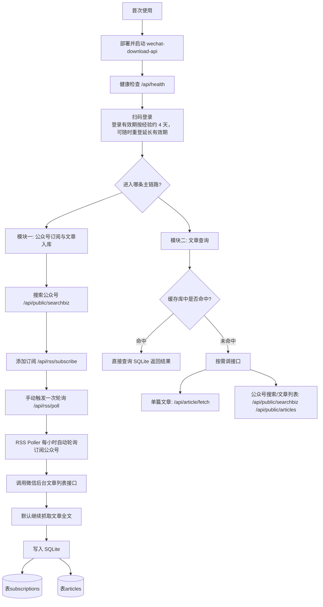
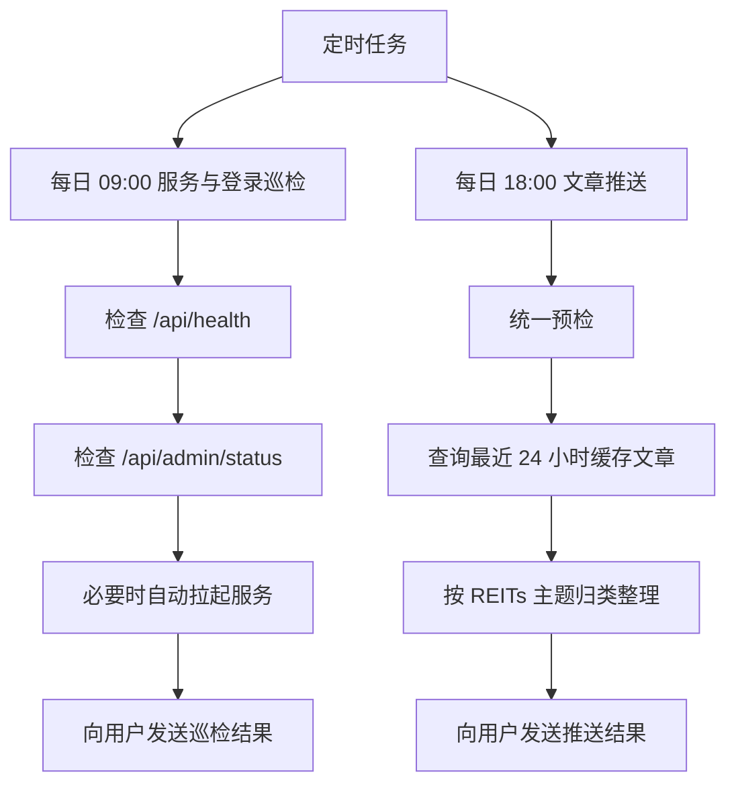

# wechat-query-skill

`wechat-query-skill` 是一个面向 OpenClaw 的微信公众号订阅、查询与推送 skill。  
它内置 `wechat-download-api` 服务，以本地部署方式运行，依赖微信公众号后台登录态拉取文章数据，并将文章缓存到 SQLite，供 LLM 后续查询、整理、分析与推送。

这个项目的重点不只是“抓取公众号文章”，而是把部署、登录、订阅、入库、查询、推送、巡检和重登串成一套可复用的自动化流程。

## 使用前提

- 拥有一个微信公众号，订阅号、服务号均可
- 本地环境已安装 Docker
- 首次使用或登录失效时，需要用户使用**公众号管理员微信**扫码登录

## 适用场景

1. 首次部署服务并完成首次登录
2. 用户主动要求重新登录，或巡检发现登录失效
3. 添加、查看、取消公众号订阅
4. 查询已订阅公众号的缓存文章
5. 用户直接发送公众号文章链接，需要读取全文或分析内容
6. 每日 18:00 汇总最近 24 小时新增文章并推送
7. 每日 09:00 巡检服务状态与登录状态

## 整体逻辑图



这张图对应两条主链路：

- 订阅与入库链路：搜索公众号 -> 添加订阅 -> 立即补一次轮询 -> 后台 `RSS Poller` 每小时自动拉取并写入 SQLite
- 查询链路：优先查缓存数据库；数据库没有时，再按需调用接口抓取

当前最关键的两张表：

- `subscriptions`
- `articles`

## 定时任务图



这两个任务职责不同：

- 巡检任务：只检查服务与登录状态，无论结果如何都要发消息
- 推送任务：基于缓存库整理最近 24 小时文章，并附带当前登录状态

## 核心能力

### 1. 服务部署与统一预检

- 内置 `wechat-download-api` 服务源码
- 统一通过 Docker Compose 启动
- 所有主要场景都先经过统一预检
- 预检默认检查：
  - `GET /api/health`
  - `GET /api/admin/status`

### 2. 登录与重登

- 支持首次登录
- 支持主动重登
- 登录有效期按经验值约 `4` 天
- 登录成功后自动保存凭证
- 首次登录与重登统一使用服务端托管二维码链路：
  - `POST /api/login/relogin/start`
  - `GET /api/login/relogin/{request_id}/qrcode`
  - `GET /api/login/relogin/{request_id}/status`

### 3. 公众号订阅与文章入库

- 搜索公众号
- 添加订阅
- 查看订阅列表
- 取消订阅
- 订阅成功后可以立即触发一次手动轮询
- 后台 `RSS Poller` 每小时自动轮询订阅公众号
- 新文章默认会继续抓取全文，并写入 SQLite

### 4. 文章查询

- 查询某个公众号的近期文章
- 按时间范围查询文章
- 按标题关键词查询文章
- 支持复杂条件组合查询
- 用户直接发来文章链接时：
  - 先查缓存库
  - 未命中时调用接口

### 5. 定时推送与巡检

- 每日文章推送：聚焦最近 24 小时发布的新增文章，推送内容默认按 REITs 主题分组整理
- 每日服务巡检：只关注服务健康与登录状态

#### 每日文章推送内容

当前 `SKILL.md` 中的推送整理规则是按公募 REITs 场景设计的，默认要求：

- 固定统计最近 24 小时发布的文章
- 按类别分组展示
- 每篇至少包含：
  - 公众号名称
  - 标题
  - 发布时间
  - 原文链接
  - 摘要或关键信息

默认分类包括：

1. 特定产品新闻
2. 政策新闻
3. 项目招标信息
4. 研究分析
5. 其他 REITs 市场新闻
6. 相关行业新闻

如果你不是用于 REITs 场景，可以在 `SKILL.md` 中调整推送分类规则和整理策略。

## 模块划分

从使用逻辑上，这个 skill 可以理解为两个主模块：

### 模块一：公众号订阅与文章入库

职责：

- 管理订阅列表
- 周期性拉取已订阅公众号的最新文章
- 将文章标题、链接、作者、发布时间、全文内容写入 SQLite

典型流程：

1. 搜索公众号
2. 添加订阅
3. 手动触发一次轮询
4. 后台轮询器持续自动入库

### 模块二：文章查询

职责：

- 响应用户对公众号文章的查询、筛选和分析需求
- 在“缓存优先”的前提下提供全文和结构化结果

典型流程：

1. 优先查询 SQLite 缓存
2. 若未命中，则按需调用接口
3. 将结果整理成适合用户阅读或适合 LLM 继续分析的内容

## 数据存储

数据库文件路径：

```text
services/wechat-download-api/data/rss.db
```

最关键的两张表：

### `subscriptions`

- 保存订阅中的公众号
- 关键字段：`fakeid`、`nickname`、`alias`、`head_img`、`created_at`、`last_poll`

### `articles`

- 保存文章元信息和正文缓存
- 关键字段：`fakeid`、`title`、`link`、`author`、`plain_content`、`content`、`publish_time`、`fetched_at`

## 接口清单

### 统一预检

- `GET /api/health`
  - 功能：检查服务是否健康

- `GET /api/admin/status`
  - 功能：获取当前登录状态

### 登录与重登

- `POST /api/login/relogin/start`
  - 功能：发起服务端托管的登录或重登二维码流程

- `GET /api/login/relogin/{request_id}/qrcode`
  - 功能：获取指定登录会话的二维码图片

- `GET /api/login/relogin/{request_id}/status`
  - 功能：轮询指定登录会话的当前状态

### 公众号搜索与文章列表

- `GET /api/public/searchbiz`
  - 功能：按关键词搜索公众号，返回可订阅公众号及其 `fakeid`

- `GET /api/public/articles`
  - 功能：获取指定公众号的文章列表，支持分页和关键词筛选

- `GET /api/public/articles/search`
  - 功能：在指定公众号内按关键词搜索文章

### 单篇文章抓取

- `POST /api/article/fetch`
  - 功能：根据文章链接抓取并解析单篇公众号文章全文

### 订阅管理与轮询

- `POST /api/rss/subscribe`
  - 功能：添加公众号订阅

- `DELETE /api/rss/subscribe/{fakeid}`
  - 功能：取消指定公众号订阅

- `GET /api/rss/subscriptions`
  - 功能：查看当前订阅列表

- `POST /api/rss/poll`
  - 功能：手动触发一次轮询，立即抓取订阅公众号的最新文章

- `GET /api/rss/status`
  - 功能：查看 RSS 轮询器当前状态

## 目录结构

```text
wechat-query-skill/
├── README.md
├── SKILL.md
├── WINDOWS.md
├── SCHEDULES.md
├── scripts/
│   ├── check_service_and_login.sh
│   └── check_service_and_login.ps1
└── services/
    └── wechat-download-api/
```

目录说明：

- `SKILL.md`：主业务逻辑文档，定义执行流程、场景规则和查询策略
- `WINDOWS.md`：Windows 环境说明
- `SCHEDULES.md`：OpenClaw 定时任务配置示例
- `scripts/`：服务与登录巡检脚本
- `services/wechat-download-api/`：内置服务源码

## 平台支持

支持以下运行环境：

- Linux / macOS
  - 默认命令、脚本、示例优先按这一类环境说明
- Windows
  - 通过 Docker Desktop + PowerShell 兼容
  - 巡检脚本使用 `check_service_and_login.ps1`

平台策略：

- 主业务逻辑只维护一份，即 `SKILL.md`
- 平台差异通过文档分支和双脚本支持解决
- 服务 API、数据库结构和核心业务流程保持一致

## OpenClaw 集成

与 OpenClaw 相关的配套文件如下：

- `SKILL.md`
- `SCHEDULES.md`
- `WINDOWS.md`
- `scripts/check_service_and_login.sh`
- `scripts/check_service_and_login.ps1`

---

如果你需要更细的业务逻辑和场景说明，请阅读：

- `SKILL.md`

如果你在 Windows 环境使用，请阅读：

- `WINDOWS.md`

如果你希望在 OpenClaw 层面配置定时任务，请阅读：

- `SCHEDULES.md`

