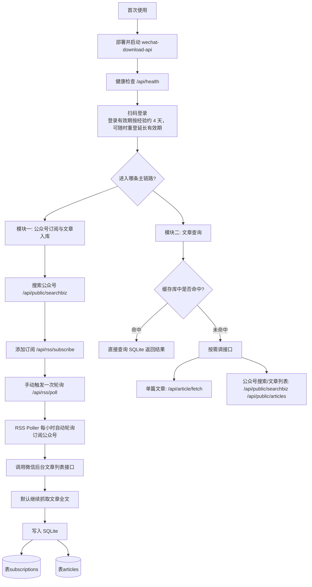
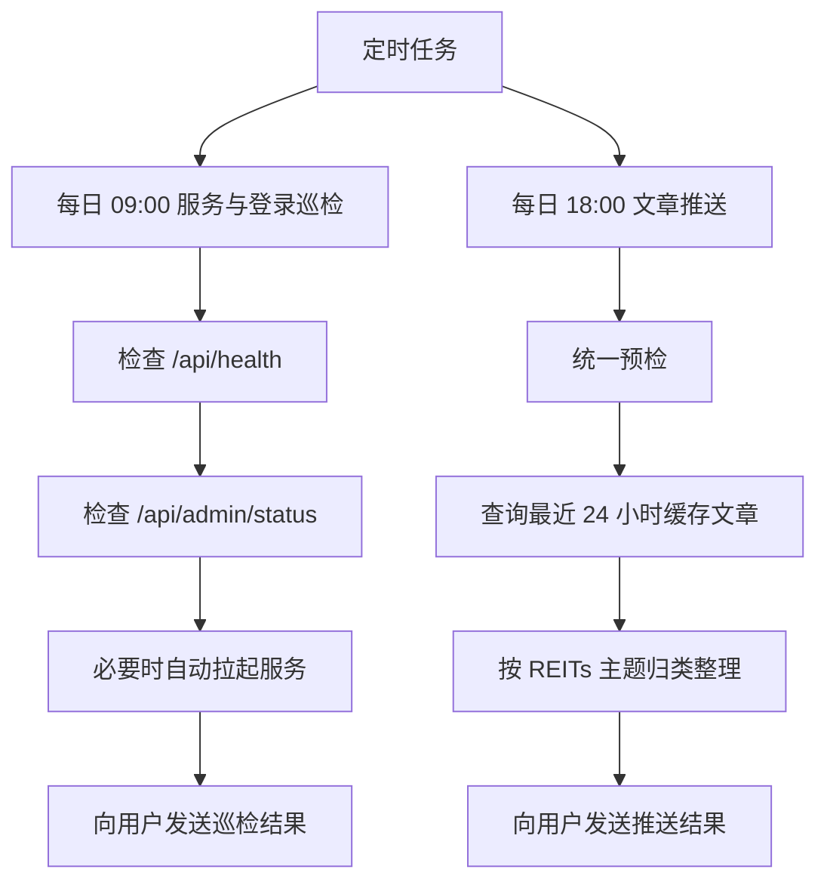

# 微信公众号订阅、查询与推送

## 使用前提

- 用户拥有一个微信公众号，订阅号、服务号均可
- 服务需要先部署并启动成功
- 首次使用或登录失效时，需要用户使用**公众号管理员微信**扫码登录

## 适用场景

1. 首次部署服务并引导用户完成首次登录
2. 用户主动要求重新登录，或巡检发现登录失效
3. 添加、查看、取消公众号订阅
4. 查询已订阅公众号的缓存文章
5. 用户发来单篇公众号文章链接，需要读取全文或分析内容
6. 每日 18:00 汇总最近 24 小时新增文章并推送
7. 每日 09:00 巡检服务状态与登录状态

## 整体逻辑图



### 两个定时任务图



## 目录与关键组件

```text
<skill-dir>/
├── SKILL.md
├── WINDOWS.md
├── SCHEDULES.md
├── scripts/
│   ├── check_service_and_login.sh
│   └── check_service_and_login.ps1
└── services/
    └── wechat-download-api/
        ├── app.py
        ├── docker-compose.yml
        ├── env.example
        └── data/
            └── rss.db
```

关键说明：

- 服务源码目录：`services/wechat-download-api`
- 服务默认内部访问地址：`http://localhost:5000`
- 文章缓存数据库：`services/wechat-download-api/data/rss.db`
- RSS 轮询器会在服务启动时自动启动
- Windows 差异说明放在 `WINDOWS.md`

## 平台支持

当前 skill 支持两类运行环境：

- Linux / macOS
  - 默认命令、脚本和示例优先按这一类环境编写
- Windows
  - 通过 Docker Desktop + PowerShell 兼容
  - 巡检脚本使用 `scripts/check_service_and_login.ps1`

## 全局规则

- 每次进入本 skill，除首次部署前的准备动作外，默认先做统一预检
- 统一预检只检查两件事：服务是否健康、登录是否有效
- 内部调用统一使用本机地址，不写公网 IP 或外部域名
- 用户主动要求重登时，可直接进入重登流程，不必先判断旧登录是否失效
- 文章查询与文章推送优先查 SQLite，未命中时再按需调接口
- 二维码必须以图片方式发给用户，不能把本地路径或容器路径当普通文本发送
- 扫码环节必须明确提醒：请使用**公众号管理员微信**扫码
- **重要**：进入长耗时步骤前要先告知用户当前动作；等待过程中要持续同步进度

## 统一预检流程

除“首次部署前的准备动作”外，新的会话默认先执行：

1. `GET /api/health`
2. `GET /api/admin/status`

处理规则：

- `health` 失败：
  - 先尝试启动或重启服务
  - 重试健康检查
  - 若仍失败，告知用户服务不可用
- `status.authenticated=false` 且从未登录：
  - 进入首次登录引导
- `status.loginState=invalid`：
  - 告知用户登录失效，需要重新登录
- `status.isExpired=true` 但未明确失效：
  - 视为“接近或达到经验过期时间”，建议用户尽快重登
- 其余情况：
  - 继续处理当前请求

说明：

- 服务启动成功，不等于登录仍然有效
- 登录有效期当前按经验值约 `4` 天估算，默认 `WECHAT_LOGIN_ESTIMATED_TTL_HOURS=96`
- 同一轮对话里如果刚做过预检且没有明显状态变化，可以复用预检结果

## 首次部署与首次登录

推荐顺序：

1. 检查 `services/wechat-download-api/app.py` 是否存在
2. 检查 Docker 与 Docker Compose 是否可用
3. 准备 `services/wechat-download-api/.env`
4. 检查 `.env` 中的镜像源配置是否可用
5. 如需从头部署，先执行一次 `docker compose down` 或 `docker-compose down`
6. 执行 `docker compose up -d --build`
7. 不要仅以容器 started 判定部署成功，继续检查服务健康状态
8. 只有 `GET /api/health` 正常后，才进入登录二维码获取流程
9. 发起服务端托管登录会话并获取二维码
10. 将二维码下载到 agent 可访问的本地路径
11. 校验二维码文件确实是图片
12. 通过飞书 `MEDIA:` 发送二维码给用户，并明确提醒用户使用**公众号管理员微信**扫码
13. 轮询扫码状态直到登录成功
14. 登录成功后，引导用户订阅需要的公众号

统一优先使用的登录链路：

1. `POST /api/login/relogin/start`
2. `GET /api/login/relogin/{request_id}/qrcode`
3. `GET /api/login/relogin/{request_id}/status`

不要把浏览器 Cookie 会话链路作为 agent 主链路：

- `POST /api/login/session/{sessionid}`
- `GET /api/login/getqrcode`

原因：

- 浏览器式链路依赖 Cookie 会话保持
- agent 直接调用时更容易拿到错误 JSON，而不是真正的二维码图片

常用部署命令：

- Linux / macOS：

```bash
cd <skill-dir>/services/wechat-download-api
cp env.example .env
docker compose up -d --build
curl -s http://localhost:5000/api/health
```

- Windows PowerShell：

```powershell
Set-Location <skill-dir>\services\wechat-download-api
Copy-Item env.example .env
docker compose up -d --build
Invoke-RestMethod http://localhost:5000/api/health
```

兼容说明：

- 各平台统一优先使用 `docker compose`
- 如果宿主机只安装了老版本 `docker-compose`，则改用 `docker-compose`
- 如果构建速度较慢，优先在 `.env` 中配置更快的镜像源后再构建

镜像源建议：

- `DEBIAN_MIRROR`
  - 默认：`mirrors.aliyun.com`
  - 如当前镜像源不可用，再切回官方源：`deb.debian.org`
- `PIP_INDEX_URL`
  - 默认：`https://pypi.tuna.tsinghua.edu.cn/simple`
  - 如当前镜像源不可用，再切回官方 PyPI，做法是清空该项或改为官方地址
- `PIP_EXTRA_INDEX_URL`
  - 默认留空
  - 仅在需要额外索引时再配置

部署成功判定：

- `docker compose up -d --build` 或 `docker-compose up -d --build` 返回，不代表服务已经可用
- 必须继续检查：
  - `docker compose ps`
  - `docker compose logs --tail 50`
  - `GET /api/health`
- 只有 `/api/health` 返回正常，才算部署完成

首次登录调用顺序：

1. `POST /api/login/relogin/start`
2. 读取返回的 `request_id`
3. `GET /api/login/relogin/{request_id}/qrcode`
4. 将二维码图片下载到 agent 可访问的本地路径
5. 校验文件存在且类型为 `PNG` 或 `JPEG`
6. 通过飞书 `MEDIA:` 发送二维码图片，并明确提醒用户使用**公众号管理员微信**扫码
7. 轮询 `GET /api/login/relogin/{request_id}/status`
8. 登录成功后继续后续订阅操作

二维码获取说明：

- agent 驱动登录时，首次登录与主动重登统一使用服务端托管二维码链路
- 首次登录与重登都优先使用：
  - `POST /api/login/relogin/start`
  - `GET /api/login/relogin/{request_id}/qrcode`
  - `GET /api/login/relogin/{request_id}/status`
- 不要使用浏览器式登录链路：
  - `POST /api/login/session/{sessionid}`
  - `GET /api/login/getqrcode`
- 不要依赖浏览器式 Cookie 会话作为 agent 的主链路
- 不要依赖容器内文件路径作为二维码发送主链路
- 下载后的二维码图片应保存到 agent 可访问的本地路径，再由消息工具读取并发送
- 发送前必须先确认文件确实是图片，而不是错误 JSON 或其他文本内容
- 二维码发送给用户时，必须使用 `message` 工具的 `media` 参数发送图片
- 不允许把本地路径、容器内路径或 `/tmp/qrcode.png` 这种路径字符串当作普通文本发给用户
- Windows 环境下同样适用以上规则，只是本地路径格式改为 Windows 路径

执行提示与长耗时处理：

- 开始部署前先告诉用户：
  - “我先进行预检，然后开始部署/启动服务，这一步可能需要几分钟，我会继续同步进度。”
- 执行 `docker compose up -d --build` 后不要长时间无反馈等待
- 若构建或启动尚未完成，应继续检查并同步进度，例如：
  - “服务还在构建/启动中，我正在继续检查状态，请稍等。”
- 检查方式包括：
  - `docker compose ps`
  - `docker compose logs --tail 50`
  - `GET /api/health`
- 二维码发送后先告诉用户：
  - “二维码已发送，请使用公众号管理员微信扫码登录，我正在等待扫码登录完成。”
- 轮询扫码状态期间，如仍未完成，应继续同步：
  - “当前还在等待扫码确认，登录完成后我会继续后续操作。”

## 用户触发场景

### 1. 增加订阅

处理流程：

1. 执行统一预检
2. `GET /api/public/searchbiz?query=公众号名称`
3. 选定 `fakeid`
4. `POST /api/rss/subscribe`
5. 订阅成功后立即调用一次 `POST /api/rss/poll`，但不等待结果
6. 告知用户订阅已完成，服务会开始抓取该公众号最新 `10` 篇文章，后续将由后台轮询自动持续入库

补充说明：

- 服务默认每次轮询每个公众号时抓最新 `10` 篇文章，默认 `ARTICLES_PER_POLL=10`
- 订阅后应手动补一次轮询，不必等下一小时

### 2. 查看订阅

处理流程：

1. 执行统一预检
2. `GET /api/rss/subscriptions`
3. 返回当前订阅列表

### 3. 取消订阅

处理流程：

1. 执行统一预检
2. `DELETE /api/rss/subscribe/{fakeid}`
3. 返回取消结果

说明：

- 取消订阅时，对应公众号缓存文章也会一起删除

### 4. 查询已订阅公众号的缓存文章

处理流程：

1. 执行统一预检
2. 优先直接查询 SQLite
3. 按用户条件筛选：
   - 指定公众号
   - 标题关键词
   - 指定时间范围
   - 最近 24 小时
   - 其他多条件组合
4. 整理结果并返回

查询方式选择规则：

- 简单固定动作优先接口：
  - 查看订阅
  - 搜索公众号
  - 获取公众号固定格式文章列表
- 灵活组合筛选优先 SQL：
  - 指定公众号 + 时间范围
  - 标题关键词 + 时间范围
  - 最近 24 小时 + 进一步筛选
  - 其他组合查询

正文规则：

- 优先使用 `plain_content`
- 若 `plain_content` 为空，再回退 `content`
  
### 5. 根据公众号文章链接读取文章

如果用户提供了微信公众号文章链接（格式：`https://mp.weixin.qq.com/s/[加密字符串]`），需要获取其内容的处理流程是：

1. 执行统一预检
2. 先按 `link` 在 `articles` 表中查是否已有缓存
3. 若命中：
   - 直接返回缓存内容
4. 若未命中：
   - 调用 `POST /api/article/fetch`，传入用户给出的公众号文章链接
5. 获取成功后：
   - 先按用户要求分析文章
   - 再告诉用户来源公众号
   - 如该公众号尚未订阅，可顺带询问是否要订阅

### 6. 主动重登

当用户明确要求“重新登录”“重新扫码登录”“重登”时，执行：

1. `POST /api/login/relogin/start`
2. 获取 `request_id`
3. `GET /api/login/relogin/{request_id}/qrcode`
4. 下载二维码到本地可访问路径
5. 校验文件确实是 `PNG` 或 `JPEG`
6. 通过飞书 `MEDIA:` 发送二维码，并明确提醒用户使用**公众号管理员微信**扫码
7. 每 3 秒轮询 `GET /api/login/relogin/{request_id}/status`
8. 成功后告知重登完成
9. 若二维码过期，则提示用户重新发起

说明：

- 主动重登不要求先退出旧登录
- 新登录成功后会直接覆盖旧凭证
- 登录有效期约 `4` 天
- `POST /api/login/relogin/start` 返回的 `qrcode_path` 是服务容器内路径，只适合作为服务内部记录
- 给用户发二维码时，应优先使用 `GET /api/login/relogin/{request_id}/qrcode` 下载图片，再发送给用户

## 定时触发场景

### 1. 每日 18:00 文章推送

处理流程：

1. 执行统一预检
2. 若服务异常，先尝试恢复；恢复失败则通知用户本次无法推送
3. 若登录失效，通知用户需要重登
4. 若状态正常，查询发布时间在最近 24 小时之内的缓存文章
5. 将文章按 REITs 主题归类整理后推送给用户
6. 推送末尾附带当前登录状态

登录状态说明：

- `lastLoginTime`
  - 来源：`GET /api/admin/status`
  - 含义：最近一次登录成功并写入凭证的时间
  - 展示方式：转换为北京时间，作为“上次扫码”
- `estimatedRemainingSeconds`
  - 来源：`GET /api/admin/status`
  - 含义：基于经验有效期估算的剩余秒数
  - 展示方式：格式化为“X天Y小时”或“X小时Y分钟”
- `status`
  - 来源：`GET /api/admin/status`
  - 含义：服务端生成的人类可读状态文本，例如“登录正常”“登录已失效，请重新登录”“登录可能已过期，建议重新登录”
  - 用途：在推送末尾直接展示当前状态

文章推送推送规范：

- 每篇至少包含：
  - 公众号名称
  - 标题
  - 发布时间
  - 原文链接
  - 摘要或关键信息

归类要求：

推送内容面向**中国 REITs 市场**，LLM 在整理新增文章时，必须先按类别归类后再展示。

分类可以参考，也可以根据具体内容自行细分，优先考虑以下类别：

1. **特定产品新闻**
   - 未上市产品相关：发行、申报、受理、审核、反馈、获批、上市准备等
   - 已上市产品相关：扩募、分红、停复牌、重大事项、运营更新、公告解读等
2. **政策新闻**
   - 监管机构、交易所、政府部门发布的与 REITs 相关政策
   - 领导公开表态、讲话、演讲、答记者问等
3. **项目招标信息**
   - 财务顾问、基金管理人、专项计划管理人、评估、审计、律师等招标或中标信息
4. **研究分析**
   - 作者或机构发布的研究观点、分析文章、研究报告
5. **其他 REITs 市场新闻**
   - 与 REITs 市场相关，但不明显属于前面几类的新闻
6. **相关行业新闻**
   - REITs 底层资产对应行业（一般为基础设施行业和商业不动产）的重要事件或新闻

规则：

- 一篇文章只归到最主要的一个类别
- 同一事件被多个公众号重复发布时，只保留一篇代表性文章
- 摘要从投资者视角提炼，不要机械截断原文

推送格式示例：

```text
📰 REITs 市场新增文章推送
检查区间：2026-04-10 18:00:00 ~ 2026-04-11 18:00:00

【特定产品新闻】

1. 标题：XX REIT 获上交所受理
   公众号：解读REITs
   发布时间：2026-04-11 09:32
   链接：https://mp.weixin.qq.com/s/xxxxx
   摘要：xxx

【项目招标信息】

1. 标题：某商业不动产 REIT 基金管理人项目中标结果公告
   公众号：解读REITs
   发布时间：2026-04-11 11:20
   链接：https://mp.weixin.qq.com/s/zzzzz
   摘要：xxx

---
登录状态
- 上次扫码：2026-04-10 08:15:00
- 预计剩余：3天2小时
- 当前状态：登录正常

如需立即重新扫码登录，请回复：需要重登
```

### 2. 每日 09:00 服务与登录巡检

处理流程：

1. 按平台选择巡检脚本
   - Linux / macOS：`scripts/check_service_and_login.sh`
   - Windows：`scripts/check_service_and_login.ps1`
2. 巡检只检查两件事：
   - 服务健康状态
   - 登录状态
3. 无论结果如何，都向用户发送一条巡检结果消息

巡检脚本输出字段：

- `ok`：整体是否正常
- `service_healthy`：服务是否健康
- `service_restarted`：本次是否自动拉起并恢复
- `status_checked`：是否成功读取登录状态
- `login_state`：`valid` / `invalid` / `unknown`
- `authenticated`：当前是否存在登录凭证
- `is_expired`：是否已失效或已达到经验过期时间
- `action`：建议动作
- `message`：脚本给出的说明

`action` 的处理规则：

- `notify_service_down`：通知用户服务异常且自动恢复失败
- `notify_login_invalid`：通知用户登录已失效，需要重登
- `notify_not_logged_in`：通知用户当前未登录
- `warn_login_expiring`：提醒用户登录接近经验过期时间，需要重登
- `none`：说明服务和登录均正常

建议的巡检消息格式：

```text
公众号服务巡检结果

- 巡检时间：2026-04-10 09:00:00
- 服务状态：正常 / 异常
- 登录状态：正常 / 未登录 / 已失效 / 接近过期
- 自动恢复结果：未触发 / 已恢复 / 恢复失败
- 处理建议：无需处理 / 需要人工处理 / 需要重新登录

如需重新扫码登录，请回复：需要重登
```

## 查询与数据库规则

默认原则：

- 先查缓存库，再决定是否调接口
- 多条件组合查询优先直接写 SQL
- 默认优先在容器内查询 SQLite，不直接查宿主机挂载文件

原因：

- 服务运行中会持续占用 SQLite，并使用 WAL / 锁机制
- 宿主机直接查询挂载数据库，可能遇到权限、锁或只读问题
- `docker exec` 在 Linux、macOS、Windows 下都更稳定

建议方式：

```bash
docker exec wechat-download-api python - <<'PY'
import sqlite3
conn = sqlite3.connect('/app/data/rss.db')
conn.row_factory = sqlite3.Row
rows = conn.execute("""
SELECT a.link, a.title, a.publish_time, s.nickname
FROM articles a
JOIN subscriptions s ON a.fakeid = s.fakeid
ORDER BY a.publish_time DESC
LIMIT 20
""").fetchall()
for row in rows:
    print(dict(row))
PY
```

## 数据库说明

数据库路径：

```text
<skill-dir>/services/wechat-download-api/data/rss.db
```

### `subscriptions`

用途：补充公众号名称并提供订阅元信息。

- `fakeid`
  - 类型：`TEXT`
  - 含义：公众号唯一标识
  - 用途：与 `articles.fakeid` 关联
- `nickname`
  - 类型：`TEXT`
  - 含义：公众号名称
  - 用途：推送与查询结果展示
- `last_poll`
  - 类型：`INTEGER`
  - 含义：最近一次轮询时间，Unix 时间戳秒
  - 用途：辅助判断服务轮询是否正常

### `articles`

用途：读取文章全文和元信息。

- `id`
  - 类型：`INTEGER`
  - 含义：文章主键
  - 用途：作为去重与推送记录标识
- `fakeid`
  - 类型：`TEXT`
  - 含义：文章所属公众号 ID
  - 用途：关联订阅表
- `title`
  - 类型：`TEXT`
  - 含义：文章标题
  - 用途：展示标题
- `link`
  - 类型：`TEXT`
  - 含义：原文链接
  - 用途：返回原文地址
- `author`
  - 类型：`TEXT`
  - 含义：作者
  - 用途：可选展示
- `plain_content`
  - 类型：`TEXT`
  - 含义：纯文本正文
  - 用途：首选全文来源
- `content`
  - 类型：`TEXT`
  - 含义：HTML 正文
  - 用途：当 `plain_content` 为空时回退
- `publish_time`
  - 类型：`INTEGER`
  - 含义：发布时间，Unix 时间戳秒
  - 用途：筛选时间范围与排序
- `fetched_at`
  - 类型：`INTEGER`
  - 含义：抓取入库时间，Unix 时间戳秒
  - 用途：辅助排查轮询延迟

### 常用查询模板

```sql
SELECT
    a.id,
    a.fakeid,
    s.nickname,
    a.title,
    a.link,
    a.author,
    a.plain_content,
    a.content,
    a.publish_time,
    a.fetched_at
FROM articles a
JOIN subscriptions s ON a.fakeid = s.fakeid
WHERE 1 = 1
  AND (:fakeid = '' OR a.fakeid = :fakeid)
  AND (:start_ts = 0 OR a.publish_time >= :start_ts)
  AND (:end_ts = 0 OR a.publish_time < :end_ts)
  AND (:keyword = '' OR a.title LIKE '%' || :keyword || '%')
ORDER BY a.publish_time ASC, a.id ASC;
```

## 接口清单

### 统一预检相关

- `GET /api/health`
  - 功能：检查服务是否健康
  - 入参：无

- `GET /api/admin/status`
  - 功能：获取当前登录状态
  - 入参：无

### 登录与重登相关

- `POST /api/login/relogin/start`
  - 功能：发起服务端托管的登录/重登二维码流程
  - 入参：无

- `GET /api/login/relogin/{request_id}/qrcode`
  - 功能：获取二维码图片
  - 路径参数：
    - `request_id`
      - 必填
      - 含义：登录/重登会话 ID

- `GET /api/login/relogin/{request_id}/status`
  - 功能：轮询登录/重登状态
  - 路径参数：
    - `request_id`
      - 必填
      - 含义：登录/重登会话 ID

### 公众号搜索与文章列表

- `GET /api/public/searchbiz`
  - 功能：按关键词搜索公众号
  - 查询参数：
    - `query`
      - 必填
      - 含义：公众号名称或关键词

- `GET /api/public/articles`
  - 功能：获取指定公众号的文章列表
  - 查询参数：
    - `fakeid`
      - 必填
      - 含义：目标公众号 FakeID
    - `begin`
      - 可选
      - 默认值：`0`
      - 限制：`>= 0`
      - 含义：偏移量，从第几条开始
    - `count`
      - 可选
      - 默认值：`10`
      - 限制：`1 <= count <= 100`
      - 含义：返回文章数量
    - `keyword`
      - 可选
      - 默认值：空
      - 含义：在该公众号内做关键词筛选

- `GET /api/public/articles/search`
  - 功能：在指定公众号内按关键词搜索文章
  - 查询参数：
    - `fakeid`
      - 必填
      - 含义：目标公众号 FakeID
    - `query`
      - 必填
      - 含义：搜索关键词
    - `begin`
      - 可选
      - 默认值：`0`
      - 限制：`>= 0`
    - `count`
      - 可选
      - 默认值：`10`
      - 限制：`1 <= count <= 100`

### 单篇文章抓取与分析

- `POST /api/article/fetch`
  - 功能：根据公众号文章链接抓取并解析单篇文章的内容
  - 请求体：
    - `url`
      - 必填
      - 含义：公众号文章链接
      - 要求：必须是可访问的微信文章 URL

### 订阅管理与轮询

- `POST /api/rss/subscribe`
  - 功能：添加公众号订阅
  - 请求体：
    - `fakeid`
      - 必填
      - 含义：公众号 FakeID
    - `nickname`
      - 可选
      - 默认值：`""`
      - 含义：公众号名称
    - `alias`
      - 可选
      - 默认值：`""`
      - 含义：公众号微信号
    - `head_img`
      - 可选
      - 默认值：`""`
      - 含义：头像 URL

- `DELETE /api/rss/subscribe/{fakeid}`
  - 功能：取消订阅
  - 路径参数：
    - `fakeid`
      - 必填
      - 含义：公众号 FakeID

- `GET /api/rss/subscriptions`
  - 功能：查看当前订阅列表
  - 入参：无

- `POST /api/rss/poll`
  - 功能：手动触发一次轮询抓取
  - 入参：无

- `GET /api/rss/status`
  - 功能：查看轮询器状态
  - 入参：无
